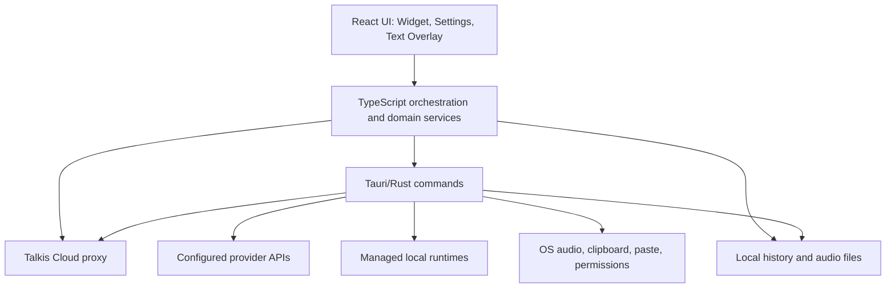

# Архитектура режимов Talkis: Облако, API и Локально

Статус: актуальное описание реализации на 17 июля 2026 года.

Этот документ отделяет техническую логику Talkis от пользовательского и маркетингового описания. Его можно использовать как основу для архитектурного обсуждения, ревью новых функций и проверки того, что один и тот же сценарий одинаково ведёт себя в режимах **Облако**, **API** и **Локально**.

## 1. Главный принцип

Talkis имеет единый интерфейс и общие пользовательские сценарии, но три разных способа выполнения вычислений:

| Режим | Где выполняется обработка | Учётные данные | Основное ограничение |
| --- | --- | --- | --- |
| Облако | Через сервисы Talkis Cloud и `proxy.talkis.ru` | `deviceToken` после входа в Talkis | Нужны интернет и активная облачная возможность |
| API | Напрямую через настроенные пользователем endpoints | API-ключи пользователя | Realtime работает только для проверенных конфигураций |
| Локально | В управляемых sidecar-процессах или другом localhost endpoint | Обычно не нужны | Синхронный перевод системного звука недоступен |

Режим определяет маршрут данных, стоимость, приватность и доступность функций. Talkis не должен незаметно переключать пользователя между режимами: такой fallback мог бы изменить место обработки данных или привести к непредвиденным расходам.

## 2. Источник истины активного режима

Активный режим вычисляется из сохранённых настроек:

```text
useOwnKey = false
  -> Облако

useOwnKey = true + STT endpoint указывает на localhost/127.0.0.1
  -> Локально

useOwnKey = true + удалённый или пустой STT endpoint
  -> API
```

Переключение вкладки в интерфейсе моделей само по себе не меняет рабочий режим. Новый режим становится активным после явного действия пользователя «Выбрать»/«Использовать». После сохранения публикуется событие обновления настроек, а виджет использует новый snapshot при следующей операции.

Важно: STT и текстовая LLM настраиваются отдельно. Например, в API-режиме распознавание может идти в один endpoint, а очистка текста — в другой. В локальном режиме управляемый STT и локальная LLM также являются разными runtime-процессами.

## 3. Слои приложения



### 3.1 React/WebView

- `Widget` принимает горячие клавиши, управляет записью, синхронным переводом и состояниями плавающих окон.
- `Settings` хранит настройки моделей, разрешений, перевода, файлов и истории.
- `WidgetTextOverlay` показывает потоковый и финальный текст независимо от основного окна виджета.

### 3.2 TypeScript orchestration

TypeScript выбирает сценарий и backend по snapshot настроек, управляет отменой, объединяет partial/final результаты и обновляет локальную историю. Здесь находятся маршрутизация диктовки, файлов, перевода выделенного текста, summary и поиска по истории.

### 3.3 Tauri/Rust

Rust отвечает за нативную запись звука, системный audio capture, media preparation, вызовы STT/Realtime, управление sidecar-процессами, вставку текста и файловое хранение истории.

### 3.4 Управляемые локальные процессы

- `talkis-stt`: единый OpenAI-совместимый `transcribe.cpp` runtime для Whisper, Qwen ASR и NVIDIA Parakeet; базовый endpoint `http://127.0.0.1:8000`.
- `talkis-diarize`: разделение речи по говорящим; базовый endpoint `http://127.0.0.1:8003`.
- `talkis-llm`: OpenAI-совместимая GGUF LLM для summary и обработки текста; предпочтительный порт `8011`.
- `talkis-ffmpeg`: конвертация видео и неподдерживаемого аудио, подготовка diarization и чанкинг больших файлов.

Если заняты стандартные порты, Talkis выбирает fallback-порт и сохраняет фактический endpoint.

## 4. Общий жизненный цикл операции

Для диктовки, файла, перевода или summary используется одна базовая схема:

1. Загрузить актуальный snapshot настроек.
2. Проверить разрешения и конфигурацию выбранного режима.
3. Получить вход: микрофон, системный звук, файл, выделенный текст или запись истории.
4. Выбрать backend без скрытой смены режима.
5. Запустить операцию с идентификатором сессии/запроса и возможностью отмены.
6. Показывать промежуточное состояние, если backend поддерживает streaming.
7. Получить финальный результат и при необходимости выполнить текстовую постобработку.
8. Показать, вставить или сохранить результат в зависимости от сценария.
9. Записать локальную историю и структурированный диагностический лог.
10. При ошибке сохранить предыдущую рабочую конфигурацию и показать пользователю понятное действие для восстановления.

## 5. Техническая матрица возможностей

Обозначения: **Да** — штатно поддерживается; **Условно** — зависит от модели, capability или дополнительного локального компонента; **Нет** — намеренно недоступно.

| Возможность | Облако | API | Локально |
| --- | --- | --- | --- |
| Batch-диктовка | Да | Да | Да |
| Потоковая диктовка | Да | Условно: проверенная Realtime-конфигурация | Условно: модель с поддержкой streaming |
| Очистка/переформатирование текста | Да | Да, если настроена LLM | Да, если выбрана локальная LLM |
| Перевод диктовки перед вставкой | Да | Да, если настроена LLM | Да, если выбрана локальная LLM |
| Перевод выделенного текста | Да | Да | Да: локальный переводчик или LLM |
| Транскрибация аудио/видео | Да | Да | Да |
| Разделение файла по говорящим | Да, при доступной cloud capability | Условно: локальный STT + diarization | Да, при установленных STT + diarization |
| Запись созвона: микрофон + системный звук | Да | Да | Да |
| Синхронный перевод системного звука | Да | Условно: проверенный OpenAI/Gemini Realtime | Нет |
| Озвучка синхронного перевода | Условно: OpenAI-backed, macOS | Условно: OpenAI, macOS | Нет |
| Summary и пользовательские промпты | Да | Да, если настроена LLM | Да, если выбрана локальная LLM |
| Локальная история и аудиофайлы | Да | Да | Да |
| ИИ-поиск по истории | Экспериментально, dev-сборка | Экспериментально, dev-сборка | Экспериментально, dev-сборка |

## 6. Диктовка

### 6.1 Захват

```text
Горячая клавиша/кнопка
  -> useWidgetRecording
  -> recordingRuntime
  -> native_voice_recorder (WAV 16 kHz mono PCM16)
  -> WebView MediaRecorder как fallback для выбранных deviceId
```

Нативный WAV-путь является основным: обычная диктовка не должна зависеть от ffmpeg. `MediaRecorder` остаётся fallback для устройств, которые WebView адресует надёжнее по `deviceId`.

### 6.2 Распознавание по режимам

- **Облако:** запрос с `deviceToken` отправляется в `/api/transcribe`; для streaming приложение получает краткоживущий Realtime credential.
- **API:** Rust вызывает настроенный OpenAI-совместимый STT endpoint. Streaming включается только после проверки конкретного adapter/model/endpoint/key fingerprint.
- **Локально:** запрос идёт в управляемый localhost STT runtime. Streaming используется только моделями, для которых он явно поддержан.

Если потоковый канал недоступен, batch-распознавание остаётся основным финальным путём. Для некоторых realtime-моделей финальный batch может уточнить промежуточный текст.

### 6.3 Завершение

После STT Talkis может применить стиль, очистку или перевод через выбранный текстовый backend. Финальный текст вставляется в ранее активное приложение. Ошибка очистки не должна уничтожать уже полученную транскрипцию: допустим возврат исходного STT-текста с понятным статусом.

## 7. Текстовый backend

`resolveSummaryBackend(settings)` используется не только для summary. Он является общим маршрутизатором текстовой LLM для очистки, промптов, перевода диктовки и LLM-fallback перевода выделенного текста:

1. Облачный режим с `deviceToken` -> `proxy.talkis.ru/api/process-text`.
2. Настроенный endpoint -> localhost считается локальным, другой адрес — custom API.
3. Собственный API-ключ без endpoint -> стандартный OpenAI-совместимый путь.
4. Нет модели или сохранён sentinel `none` -> backend недоступен, управляющее действие блокируется с подсказкой выбрать модель.

Управляемый `talkis-llm` может автоматически перезапуститься только когда сохранён `llmLocalModelId`. Произвольные Ollama/LM Studio endpoints вызываются как внешние локальные серверы и не управляются Talkis.

Длинные тексты обрабатываются map-reduce чанками. Для локальных моделей применяются меньшие лимиты контекста.

## 8. Перевод

### 8.1 Выделенный текст

Отдельная глобальная горячая клавиша копирует выделение из активного приложения и запускает новый запрос. Новый запрос отменяет предыдущий, очищает старое состояние и сразу заменяет содержимое overlay. Финальный результат автоматически скрывается через десять секунд, если пользователь не закрыл его раньше.

Локальный режим сначала использует выбранный специализированный переводчик (NLLB-200 или OPUS для поддерживаемой языковой пары), затем может использовать локальную LLM. Облако и API используют общий текстовый backend.

### 8.2 Синхронный перевод

```text
Системный звук (+ опционально микрофон)
  -> native capture
  -> отдельная Realtime-сессия на каждый канал
  -> partial/final translated events
  -> объединение соседних частей одного говорящего
  -> text overlay + local history
  -> optional translated voice playback on macOS
```

- **Облако:** `deviceToken` обменивается на краткоживущий credential. Постоянный ключ провайдера не попадает в desktop-приложение.
- **API:** поддерживаются только успешно проверенные OpenAI/Gemini Realtime adapters.
- **Локально:** запуск блокируется до захвата аудио с явным сообщением о недоступности.

Системный звук переводится всегда. Микрофон можно включить как дополнительный канал перевода; при сохранении аудио он всё равно записывается отдельной дорожкой. Озвучка сейчас доступна для OpenAI-backed сессий на macOS, где Talkis исключает собственный процесс из захвата и может приглушить оригинал, чтобы избежать петли.

## 9. Файлы и говорящие

```text
Файл до 8 ГБ
  -> native path, без загрузки всего файла в WebView
  -> probe / conversion при необходимости
  -> chunking
  -> STT
  -> optional diarization
  -> merge / history
```

- Готовый WAV `16 kHz mono PCM16` может идти напрямую в локальный STT.
- Видео, неизвестные форматы, большие файлы и diarization preparation используют `talkis-ffmpeg`.
- В облаке speaker mode использует облачную capability подписки.
- В локальном режиме используются локальные STT и diarization runtimes.
- В API-режиме speaker mode сейчас является гибридным: он требует локального STT/diarization комплекта, а не произвольной provider diarization API.

Первый найденный говорящий отображается как `Вы` — это детерминированное правило интерфейса, а не биометрическое распознавание голоса. Остальные получают имена `Гость N`; пользователь может свободно переименовать их, и новое имя применяется ко всем сегментам этого speaker ID.

## 10. Созвоны

Созвон записывается в две синхронизированные дорожки:

- микрофон — `Вы`;
- системный звук — `Созвон`.

Нативный system-audio capture:

- macOS: Core Audio system/process tap;
- Windows: WASAPI loopback default output device;
- Linux: PipeWire monitor stream; без PipeWire сценарий завершается понятной ошибкой.

После остановки дорожки сохраняются и передаются в файловый pipeline для транскрибации. В истории они воспроизводятся синхронно, а не как один заранее смешанный файл.

## 11. История и ИИ-поиск

История голоса, файлов, созвонов и синхронного перевода хранится локально в app data (`history/history.json` и связанные аудиофайлы). Выбранный режим обработки не меняет локальный характер истории.

Экспериментальный чат истории сейчас доступен только в dev-сборке. Его путь:

```text
Запрос пользователя
  -> локальный индекс истории
  -> offline semantic templates + lexical ranking
  -> optional embeddings при совместимом embedding backend
  -> ограниченный контекст с источниками
  -> выбранный Cloud/API/Local text backend
  -> ответ со ссылками на записи
```

Offline-шаблоны покрывают не конкретные фразы запроса, а классы намерений: проблемы/баги, задачи, решения, идеи, обязательства и риски. Embeddings являются усилением поиска, а не обязательным условием работы.

## 12. Настройки, горячие клавиши и конкурентные запросы

- Настройки загружаются при старте и сохраняются после подтверждённого изменения.
- Горячие клавиши диктовки и перевода проходят одну транзакцию: захват полного аккорда -> нормализация -> проверка конфликта -> регистрация новой -> сохранение -> снятие старой.
- При ошибке новая комбинация откатывается, старая остаётся активной.
- `requestId` и target не позволяют позднему ответу предыдущего запроса изменить новое состояние.
- Для пользовательских операций действует тот же принцип: новый перевод выделения или новый retry не должен ждать исчезновения старого overlay и не должен применять устаревший результат.

## 13. Данные, безопасность и диагностика

| Данные | Облако | API | Локально |
| --- | --- | --- | --- |
| Аудио/текст запроса | Передаётся через Talkis proxy | Передаётся настроенному провайдеру | Остаётся на устройстве |
| Provider key | Хранится на серверной стороне Talkis | Хранится локально в настройках | Обычно отсутствует |
| `deviceToken` | Хранится локально | Не используется | Не используется |
| История | Локально | Локально | Локально |

Секреты не должны попадать в UI events и логи. Диагностические логи должны содержать режим, endpoint без секрета, adapter/model, session/request ID, этап операции, длительность, chunk index/size, recorder stats и уровни call-capture.

Ошибки классифицируются как минимум на: отсутствие конфигурации, отсутствие разрешения, недоступный runtime/endpoint, timeout, provider authentication, capability unavailable, отмена и ошибка сохранения. Сообщение пользователю должно объяснять следующий шаг, а лог — техническую причину.

## 14. Карта основных исходников

| Область | Основные файлы |
| --- | --- |
| Настройки и определение режима | `src/lib/store.ts`, `src/windows/settings/tabs/SettingsTabs.tsx` |
| Диктовка и вставка | `src/windows/widget/hooks/useWidgetRecording.ts`, `src/windows/widget/services/transcriptionPipeline.ts` |
| Нативная запись | `src-tauri/src/native_voice_recorder.rs` |
| Потоковая диктовка | `src/windows/widget/services/dictationStreamOverlay.ts`, `src-tauri/src/live_dictation.rs` |
| Текстовая LLM | `src/lib/summarize.ts`, `src/lib/cloudTextProcessing.ts` |
| Перевод выделения | `src/windows/widget/services/selectionTranslation.ts` |
| Синхронный перевод | `src/windows/widget/services/liveTranslation.ts`, `src-tauri/src/live_translation.rs`, `src-tauri/src/realtime.rs` |
| Файлы | `src/lib/fileTranscription.ts`, `src-tauri/src/media/mod.rs` и модули `src-tauri/src/media/` |
| Созвоны | `src/lib/callCapture.ts`, `src-tauri/src/call_capture.rs` |
| История | `src/lib/store.ts`, `src-tauri/src/history_storage.rs`, `src/windows/settings/tabs/MainTab.tsx` |
| ИИ-поиск по истории | `src/lib/devChatHistoryContext.ts`, `src/lib/historyEmbeddings.ts`, `src/lib/offlineHistorySearchTemplates.ts` |

## 15. Решения, которые требуют отдельного обсуждения

1. Нужен ли production-доступ к ИИ-чату истории и какие лимиты/источники должны быть у него по умолчанию.
2. Должен ли API-режим поддерживать provider-native diarization без локальных моделей.
3. Нужна ли озвучка синхронного перевода на Windows/Linux и каким способом исключать собственный звук Talkis из повторного захвата.
4. Какие облачные capability и тарифные лимиты должны отображаться до запуска операции.
5. Следует ли в будущем разделить единый `useOwnKey` на независимые STT/LLM/Realtime mode selectors, чтобы официально поддерживать гибридные конфигурации.
